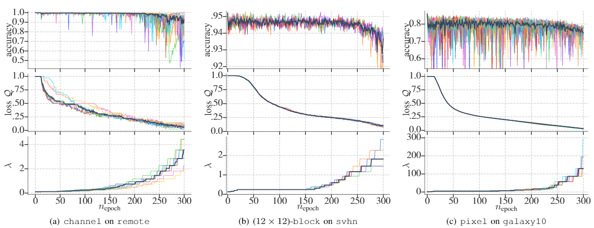
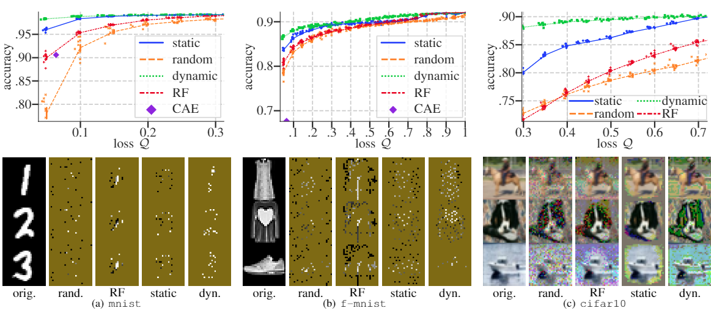
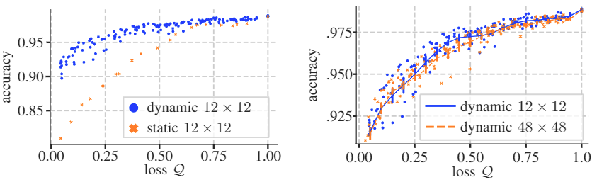

# Input Selection for Bandwidth-Limited Neural Network Inference
This repository contains the code to reproduce the results from the paper accepted at SIAM International Conference on Data Mining (SDM22).

The starting script is ``create_mask.py``. 
An overview over the parameters can be obtained with ``python create_mask.py --help``.
The settings for all the experiments can be found in the supplementary section of the paper and each experiment script can be found in the directory ``exp_scripts``.


## Quick Start on MNIST

**static mask**:
```
python create_mask.py --dataset mnist --mask-type static
    --n-repeats 10 --lambda-init 0.0005
    --lr 0.0005 --lr-net 0.001 --lambda-factor 1.5
    --use-warmup-net 1 --n-epochs 400 --lambda-patience 5 
    --input-drop-upscaling False
```
alternatively, just run: ```sh exp_scripts/static_pixel_mnist```

**dynamic mask**:
```
python create_mask.py --dataset mnist --mask-type dynamic
    --dynamic-mask linear --n-repeats 10 --lambda-init 0.0005
    --lr 0.0005 --lr-net 0.001 --lambda-factor 1.5
    --use-warmup-net 1 --n-epochs 400 --lambda-patience 5 
    --input-drop-upscaling False
```
alternatively, just run: ```sh exp_scripts/dynamic_pixel_mnist```

## Mandatory Parameters
- ```--dataset```: which dataset to use (e.g. mnist, cifar10, fashion_mnist, svhn)
- ```--mask-type```: our approach supports ``static`` (instance independent) and ``dynamic`` (instance dependent) masks,
 further one can provide a ``given`` mask (random forest feature importance values) or
 a ``random`` mask that makes random choices.
    - if ``given`` or ``random`` is chosen, you can decide of many (``--random-num-del``) and 
    how often (``--random-change-iter``) choices are made
    
## Logs
A new log will be created for each run in the log directory (default: ``runs``).
It is organized by dataset, then mask type, and finally all non-standard parameters and the repetition of the run.
Each log contains a tensorboard log and checkpoints at 5% accuracy intervals.

## Results from the paper 
All results were created with output from this library.


Performance of the different mask schemes on three datasets. The black line is the average value of the runs and individual runs are displayed indifferent colors. Note that the fluctuations are induced by the training process during which the input data are partially ignored.



Comparison of different selection schemes.
The top row shows the behaviour w.r.t. the mask loss. The bottom row shows instances for different: mnist (left) ~2.42%, fashion-mnist (middle) ~6%, and cifar10 (right) ~66%.
Dark yellow color filling corresponds to removed pixels for mnist and fashion-mnist.
For cifar10 grey indicates completely removed pixel while tints indicate that channels for a pixel are disabled (e.g., green tinted pixel indicates missing red and blue).


Comparing dynamic and static mask selection as well as different block sizes on ship dataset.
